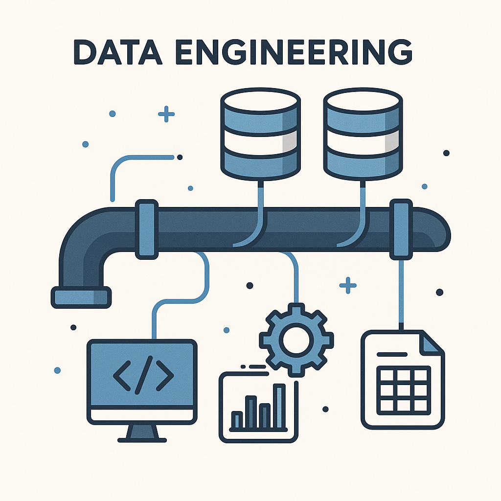

# 소개

필자는 it전공은 아니지만 관련 전공 학위 취득을 원하는 사람으로써 생각과 아이디어를 디스플레이에 그대로 구현할 수 있고, 

그게 곧 상품성을 지닌 아이템이 되는 프로그래밍의 매력에 빠져 입문하게 되었다. 그 중에서도 데이터 분야는 아이디어를 아이템으로 만들기 위해

필요한 필수 기반이라고 생각했고, 이 README는 데이터 엔지니어로서의 경험과 자격을 갖추기 위한 나만의 요약본이자 설계도이다.

## 목표역량

데이터 엔지니어(백엔드 및 데이터 분석 역량을 겸한 복합 인재)

선택이유 : 데이터 정제는 데이터의 품질과 직결되고, 데이터의 품질은 AI 학습모델의 설계구조와 비교해도 뒤쳐지지 않을 만큼

AI의 결과물에 직접적인 영향을 미친다. AI산업의 확장에 수혜를 받을 직종이며 실무흐름의 중간단계이기 때문에 협업이 필수이고,

협업 기반 실무경험에 의해 도메인 지식이 경쟁력이 될 수 있다는 점이 이점이라고 생각한다. 

백엔드를 비롯해 다른 데이터 분야로의 커리어 전환이 비교적 자유롭다는 점도 목표 설정에 기여했다. 

## 로드맵 설계

- *기반지식*
  - python, javaScript
  - OS, HTTP, 네트워크
  - 리눅스 CLI, BASH 명령어
  - 통계학, 선형대수학 (**ML엔지니어링 협업 대비**)
  - DB, Rest API
    

- *백엔드 역량 구체화*
  - FastAPI, react  (**웹 프레임워크**)                       
  - JSON 응답, 요청 처리  (**API설계**)               
  - RDB-PostgreSQL  (**데이터베이스**)                  
  - JWT 인증, OAuth 기초  (**로그인, 보안처리**)  
  - pytest, Postman  (**API테스트 및 자동화**)
    

- *데이터 엔지니어링 역량 구체와*
  - 웹 크롤링, API 호출, Kafka  (**수집**)
  - pandas, 정규표현식, JSON 처리  (**전처리**)
  - S3, PostgreSQL, BigQuery  (**저장**)
  - Apache Airflow (DAG, Task)  (**자동화**)
  - Kafka → Airflow → S3 → DB 저장 흐름  (**파이프라인 구축**)
  - Superset, Metabase, Tableau 이해  (**분석도구연계-시각화 등**)
    

- *인프라 및 배포 역량*
  - AWS EC2, SSH 접속, 인스턴스 운영  (**가상 서버**)
  - S3, 버킷 정책, 정적 파일 저장  (**스토리지**)
  - Dockerfile, 이미지 빌드, 컨테이너 실행  (**docker**)
  - Terraform, AWS CloudFormation  (**코드형 인프라 자동화**)
  - Grafana, Prometheus, 로그 수집  (**모니터링**)
  - GitHub Actions, AWS CodePipeline  (**코드배포 자동화 CI/CD**)
    
 
## 경험의 방향성

아직 it지식이 풍부하지 않아서 옳은 방향이라고 확신할 수는 없지만, 

웹 개발 프로젝트에 참여해 백엔드 중심으로 실무역량을 늘리고 최종적으로는 데이터 파이프라인을 직접 구현하여

데이터의 수집, 정제, 저장, 시각화를 자동화하고 팀원들과의 결과 분석을 통해 소비자 맞춤 솔루션을 제공하는 웹 개발 프로젝트를 진행하고자 한다.
    

